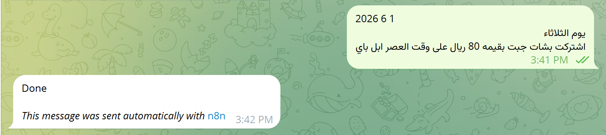
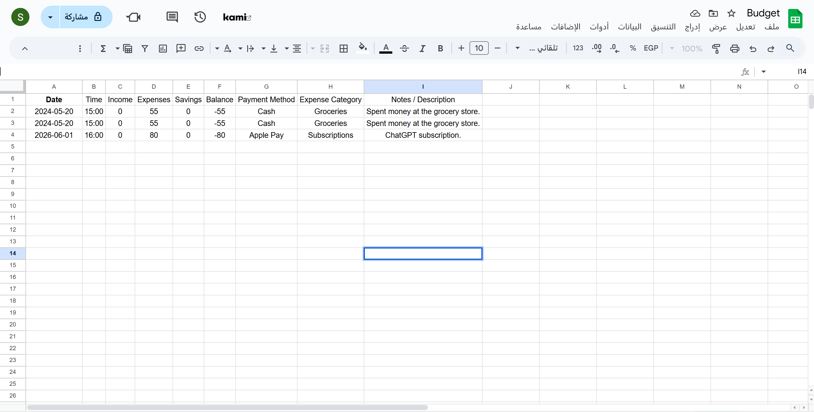

# 💸 AI Budget Tracker using n8n

An AI-powered personal finance automation built with **n8n**.
The system understands natural language messages (Arabic or English),
extracts financial data using AI, and automatically stores it in Google Sheets.

---

## ✨ Features

- 🤖 AI Agent understands free-text financial messages
- 💬 Telegram Bot input (natural language)
- 📊 Structured budget tracking in Google Sheets
- 🧠 Automatic extraction:
  - Date & Time
  - Expenses / Income
  - Payment Method
  - Expense Category
  - Notes
- 🔁 Fully automated workflow using n8n

---

## 🔄 Workflow Overview

1. User sends a message via Telegram  
2. AI Agent extracts structured financial data  
3. JavaScript node cleans & prepares the data  
4. Data is appended to Google Sheets  
5. User receives confirmation message  

---

## 🧩 Technologies Used

- n8n
- Google Gemini (AI Agent)
- Telegram Bot API
- Google Sheets
- JavaScript

---

## 🖼️ Screenshots

### Workflow

### Telegram Example

### Google Sheet

---

## 👩‍💻 Author

Sara Aljuraybah
